# yummy

  
  <h3 align="center" margin-top="-40">YUMMY</h3>

 

## 👀 Qué es Yummy?
Yummy es una red social de recetas en la que podrás crear y compartir nuevas con tus amigos para satisfacer la necesidad de todos aquellos que necesitan ideas en el día a día para sus comidas. Yummy también incorpora una lista de compra para que no te olvides de echar al carro de la compra todo lo que necesites. Podrás guardar en favoritos las recetas que más te gusten para siempre tenerlas al alcance
###### (Este ultimo apartado está en desarrollo) <a href="https://youtu.be/CGdkBg0QYNQ">Ver video</a>

------

## 📱 Plataformas 
Yummy está desarrollada para que pueda ser utilizada en Android

Podrás probar la aplicación a través del siguiente link de [descarga](https://github.com/gonzalosalmeron/yummy/blob/main/media/yummy.apk "descarga")

Para iniciar sesión deberás crearte un usuario con tus credenciales  

------
## 🤖 Tecnologías usadas

  
  

    
    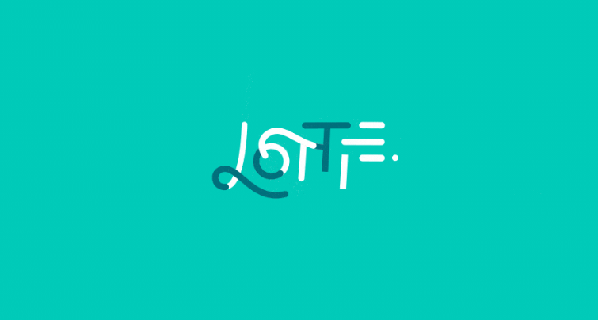

 
------

## 🎮 Funcionamiento y maquetación
···· Leer de izquierda a derecha ····

### Diapositivas 

### Autenticación
La sección de autenticación consta de tres partes:
  1. Pantalla de autenticación ->
  Se mostrará un mensaje de bienvenida a la aplicación junto a varios botones con los
  cuales el usuario podrá elegir entre registrarse o iniciar sesión
  
  2. Pantalla de registro ->
  El usuario podrá registrarse creando un usuario con los siguientes datos: imagen de
  perfil, nombre, correo electrónico y contraseña
  
  3. Pantalla de inicio de sesión ->
   El usuario podrá iniciar sesión para poder acceder a la aplicación

  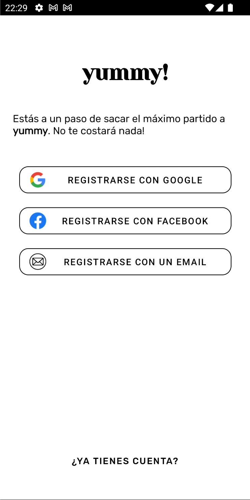
  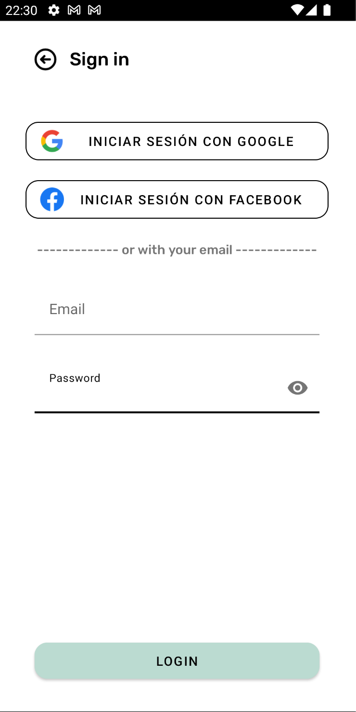
  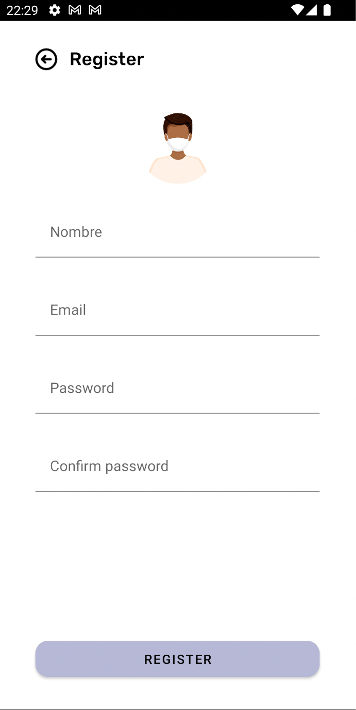

### Búsqueda
La sección de búsqueda permite al usuario poder ver todas las recetas creadas por todos los usuarios de Yummy además de poder realizar búsquedas basándose en el nombre de la receta.

  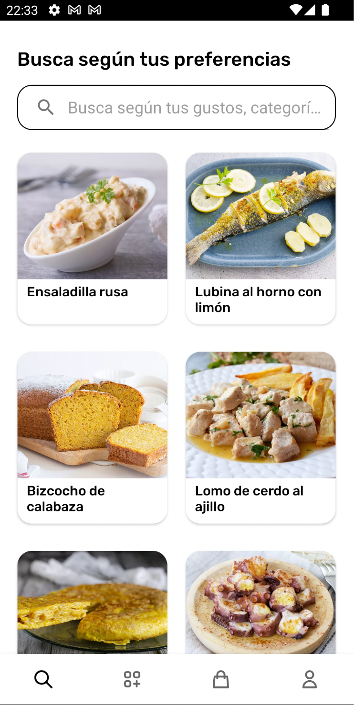
  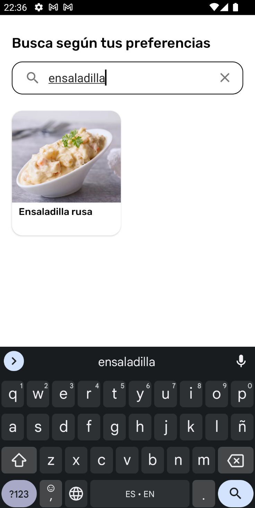
  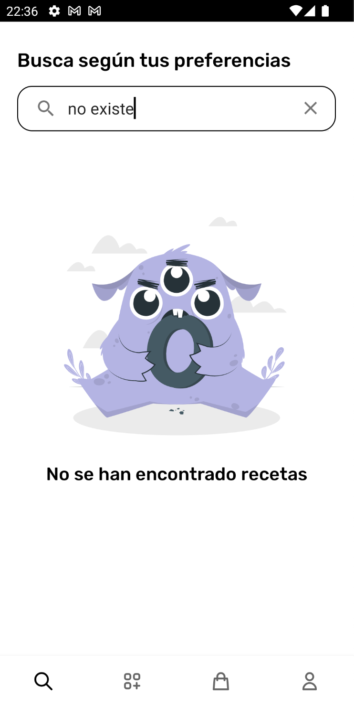

### Creación de receta
La sección de creación de receta como su nombre indica permite al usuario crear nuevas recetas y subirlas a la comunidad

  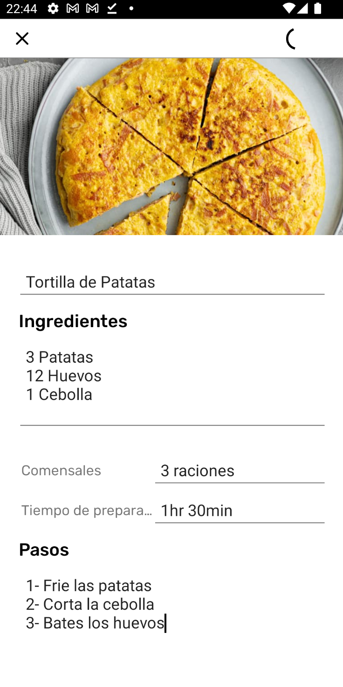
  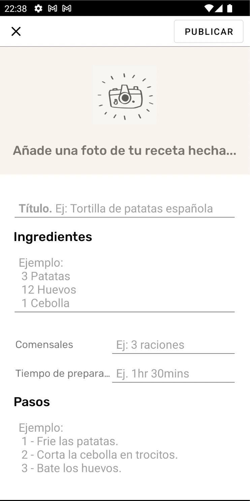

### Lista de la compra
En esta sección el usuario podrá crear una lista de la compra pudiendo crear o eliminar los productos de una manera súper sencilla. También podrá marcarlos como completados

  
  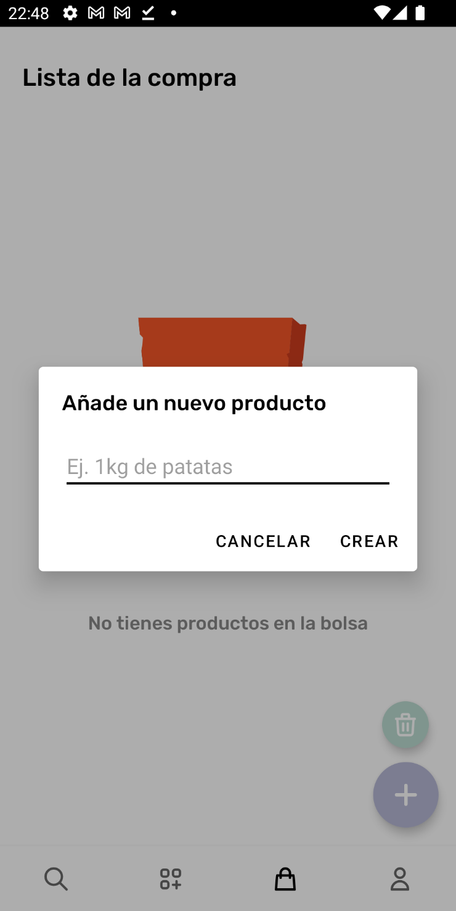
  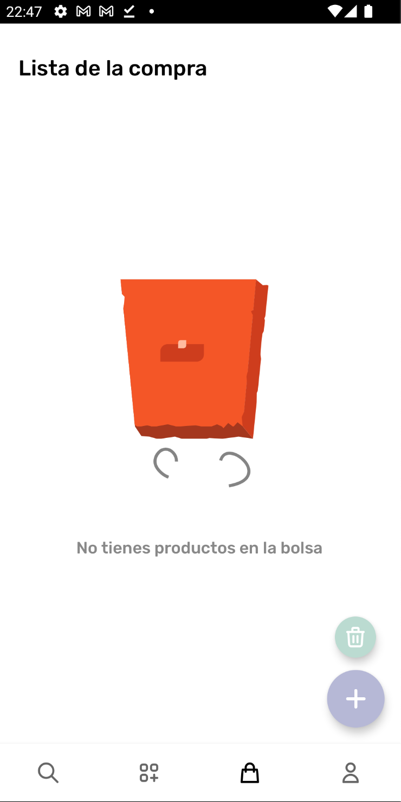
  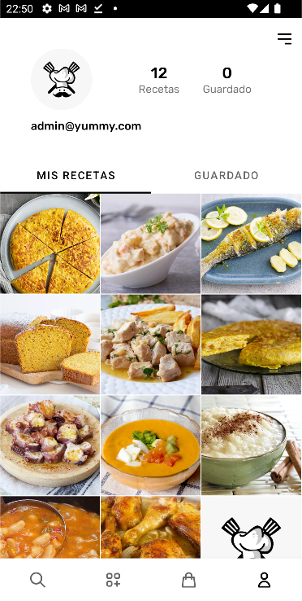

### Perfil
En la sección del perfil podrá ver ver todas sus recetas y las recetas creadas. También podrá cerrar sesión.

  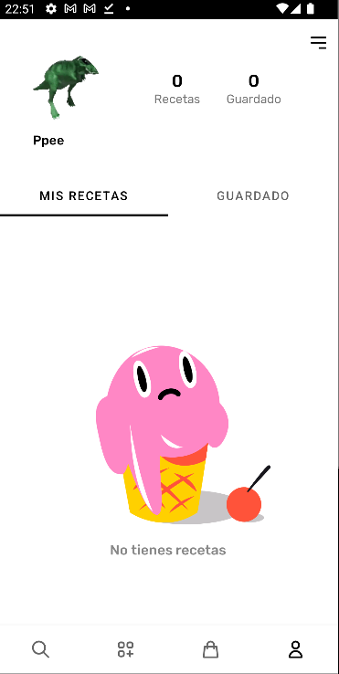

## 📄 Documentación PDF
Se puede descargar la documentación en pdf desde [aquí](https://github.com/gonzalosalmeron/yummy/blob/main/media/Yummy.pdf "descarga")

## 📚 Bibliografía
[Youtube](https://www.youtube.com/)
[AndroidDvlpr](https://androiddvlpr.com/)
[StackOverflow](https://es.stackoverflow.com/)

## ⏱ Progreso

- Semana 1 -> Maquetación de app con figma y diseño de bd
- Semana 2 -> Creación de primeras actividades de auth (login y register) y aplicar funcionaliad
- Semana 3 -> Creación de fragmentos de la pantalla principal, upload y perfil y añadir funcionalidad
- Semana 4 -> Creación de recetas y aplicarlas en la vista
- Semana 5 -> Nuevas opciones añadidas(crear un item en la bolsa, eliminarlo, mensaje de error...)
- Semana 6 -> Implementación de búsqueda de recetas y fix de bugs
- Semana 7 -> Nuevas opciones del registro para poder añadir imagen al perfil

## Otros repositorios
[Landing + Angular Admin + Python](https://github.com/gonzalosalmeron/yummy_angular)
