# yummy

  
  <h3 align="center" margin-top="-40">YUMMY</h3>

 

## 👀 Qué es Yummy?
Yummy es una red social de recetas en la que podrás crear y compartir nuevas con tus amigos para satisfacer la necesidad de todos aquellos que necesitan ideas en el día a día para sus comidas. Yummy también incorpora una lista de compra para que no te olvides de echar al carro de la compra todo lo que necesites. Podrás guardar en favoritos las recetas que más te gusten para siempre tenerlas al alcance
###### (Este ultimo apartado está en desarrollo) <a href="https://youtu.be/CGdkBg0QYNQ">Ver video</a>

------

## 📱 Plataformas 
Elmo está desarrollada para que pueda ser utilizada en Android

Podrás probar la aplicación a través del siguiente link de [descarga](https://github.com/gonzalosalmeron/yummy/blob/main/media/yummy.apk "descarga")

Para iniciar sesión deberás crearte un usuario con tus credenciales  

------
## 🤖 Tecnologías usadas

 

 
------

## 🎮 Funcionamiento y maquetación
···· Leer de izquierda a derecha ····

### Diapositivas 

### Pantallas de bienvenida

  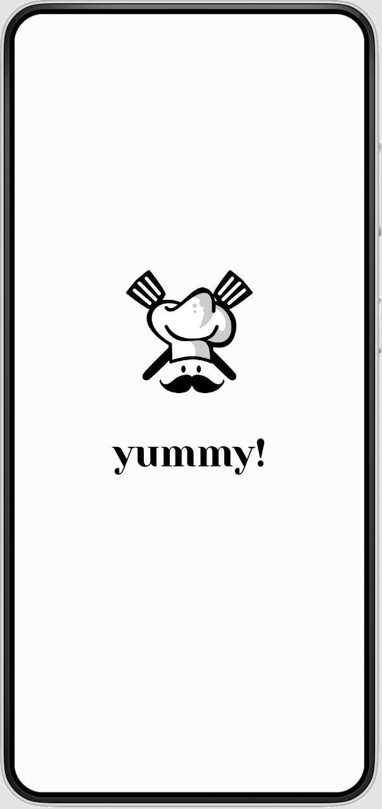
  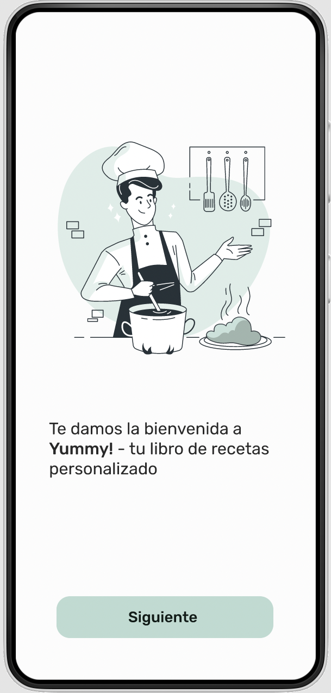
  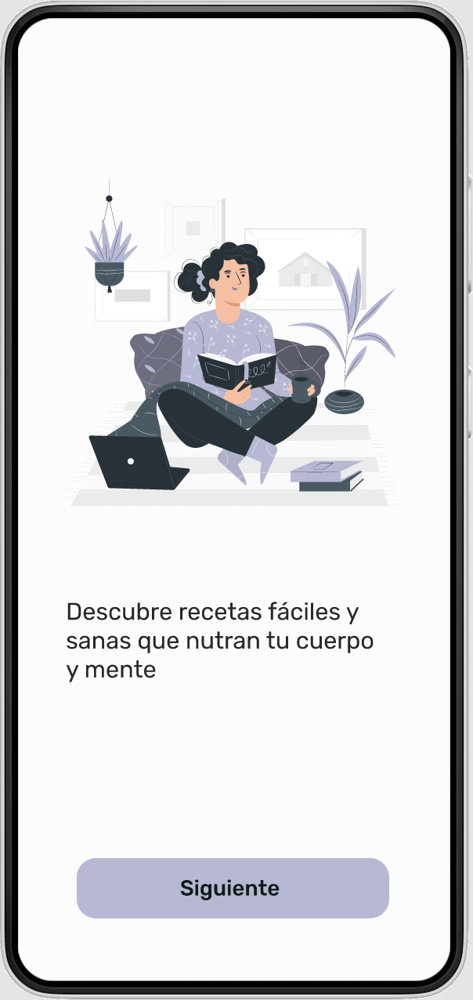
  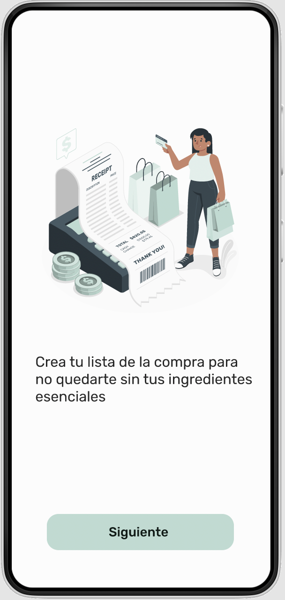

### Pantallas Login y Registro

  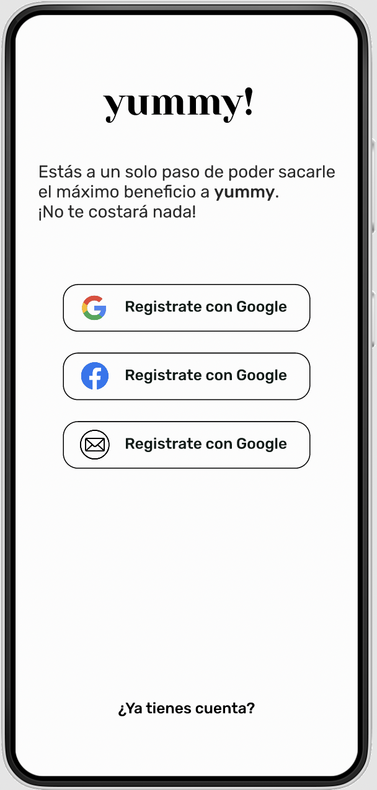
  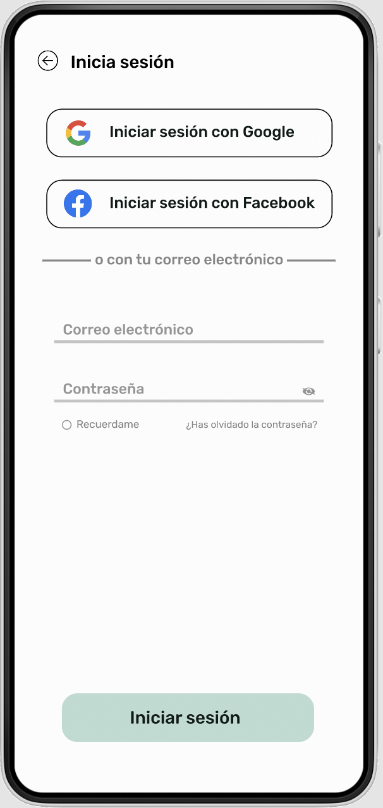

### Home, Busqueda

  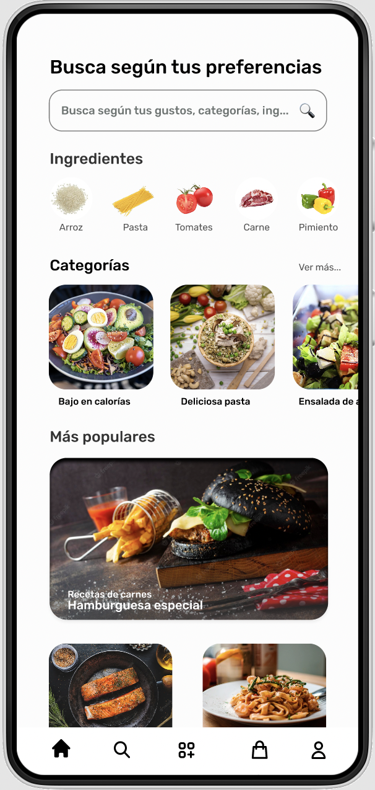
  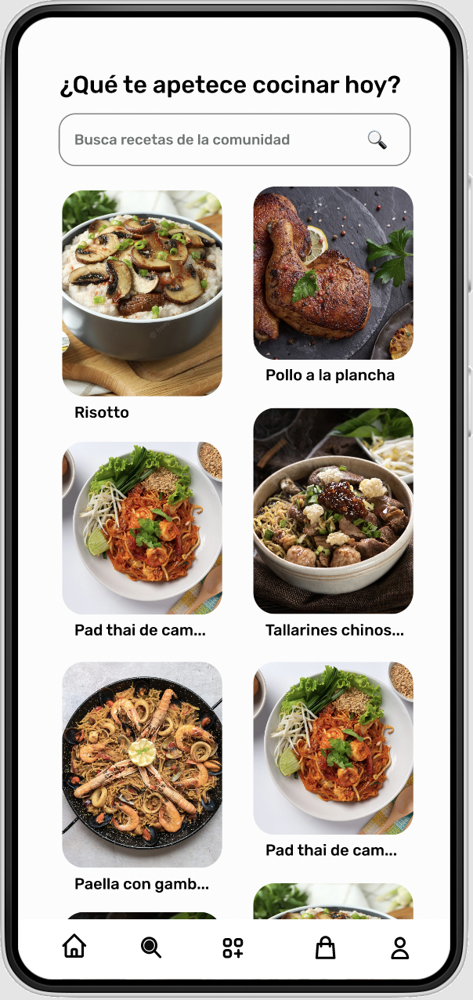

### Subida de recetas, Lista de compra y Perfil

  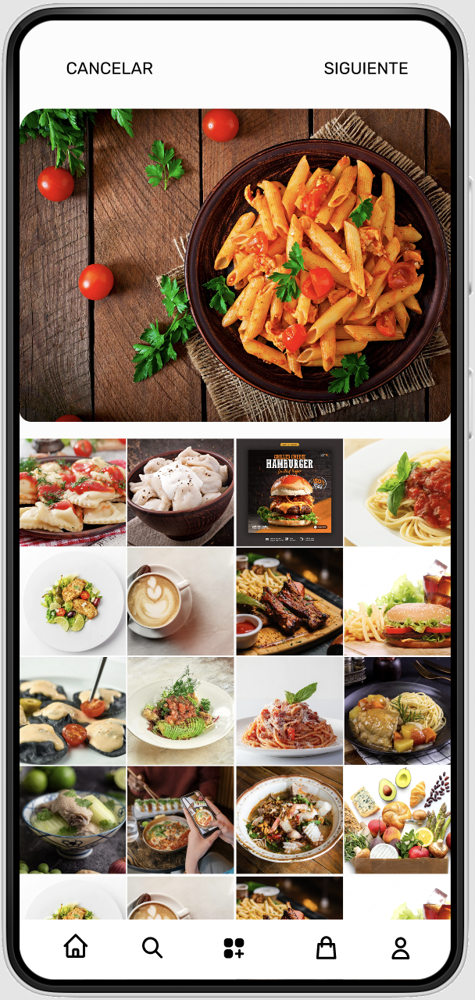
  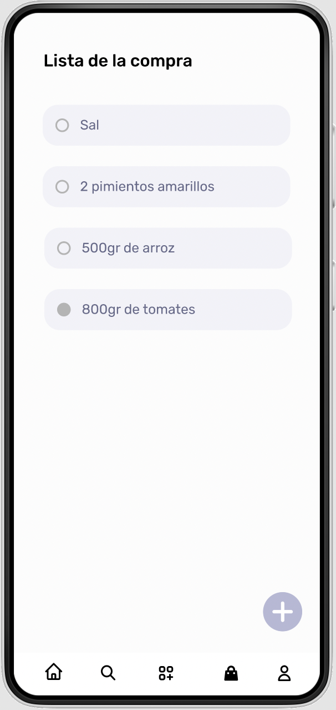
  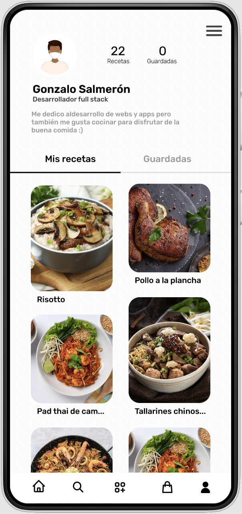
  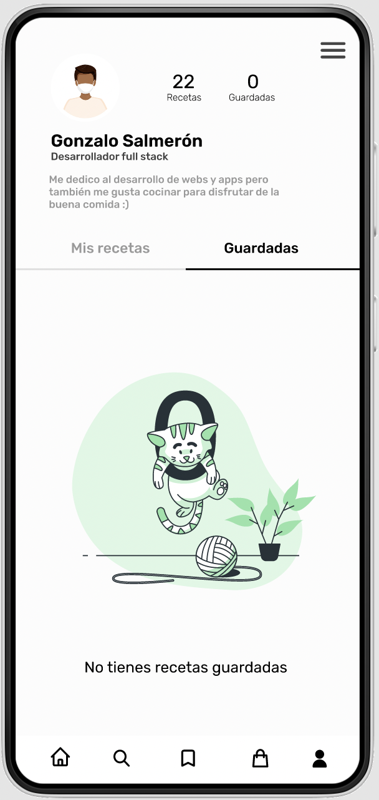

## ⏱ Progreso

- Semana 1 -> Maquetación de app con figma y diseño de bd
- Semana 2 -> Creación de primeras actividades de auth (login y register) y aplicar funcionaliad
- Semana 3 -> Creación de fragmentos de la pantalla principal, upload y perfil y añadir funcionalidad
